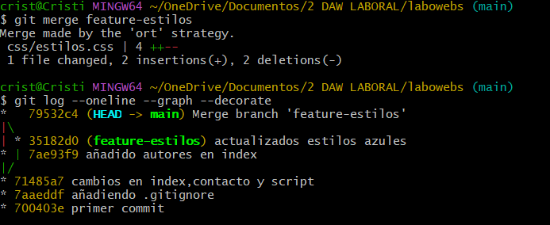
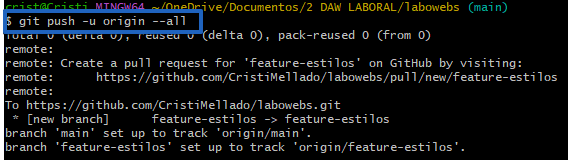
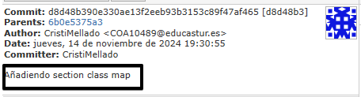
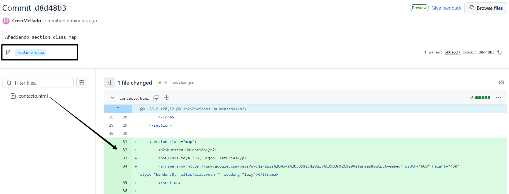
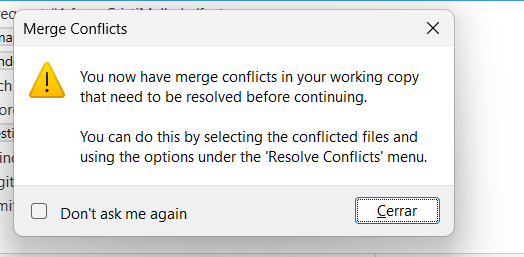
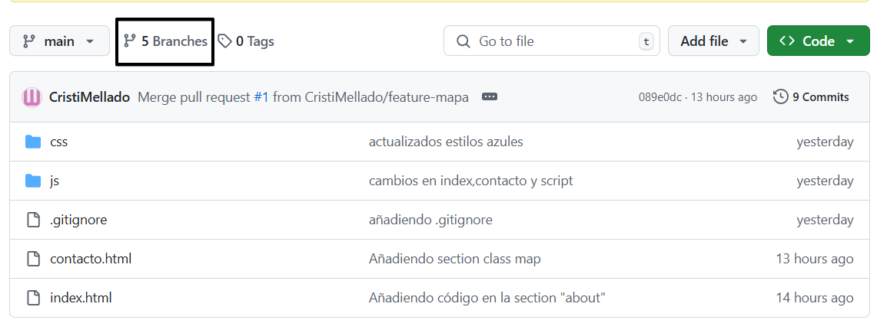
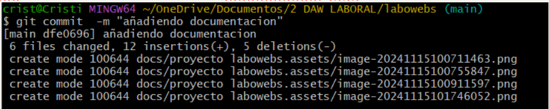
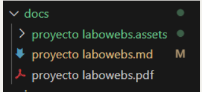
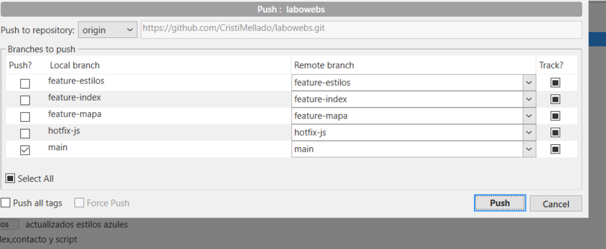
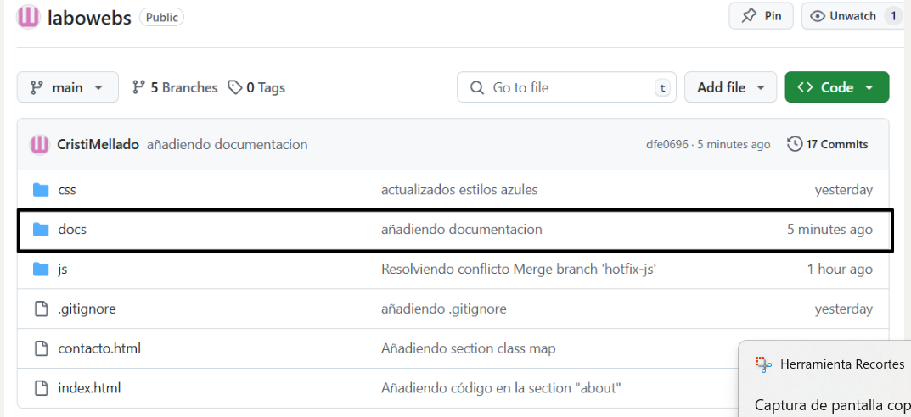

**Autor: Cristina Mellado**
Proyecto Labowebs.

# Ejercicio de Git - Proyecto Labowebs.

[TOC]

# Trabajo en Local

## **Cuestiones**

1. Inicializa un nuevo repositorio Git en una carpeta llamada `"labowebs"`y agrega los archivos proporcionados en el aula virtual. Renombra la rama `master` a `main` , si es necesario. Realiza el primer commit. Muestra el log del repositorio.

```bash
git init
git add .
git branch -m master main
git commit -m "primer commit"
git log 
```


2. Incluye un fichero `.gitignore` para que los ficheros `README.md` , `LICENCE.txt` y `passwords.txt` sean ignorados por el control de versiones. Realiza el commit y muestra los logs del repositorio en una línea.

   ```bash
   notepad .gitignore
   git add .gitignore
   git commit -m "añadiendo .gitignore"
   git log --oneline
   ```
   


3. En el repositorio, crea los archivos `README.md` , `LICENCE.txt` y `passwords.txt` con algún contenido. Muestra el estado del repositorio. Muestra el listado de archivos ignorados.

   ```bash
   touch README.md
   touch LICENCE.txt
   touch passwords.txt
   notepad README.md
   notepad LICENCE.txt
   notepad passwords.txt
   git status
   git status --ignored
   git ls-files --ignored --exclude-standars --others
   ```
   


4. Crea una rama `feature-estilos` . Cámbiate a ella. 

   * Modifica el archivo `estilos.css` : propiedad color del body y de h2 : #ff0 propiedad background-color de header y footer: #7acffe .
   * Comprueba el estado del repositorio. Añade los cambios, realiza un commit con el mensaje "actualizados estilos a azules".
   
   ```bash
   git branch feature-estilos
   git checkout feature-estilos
   git status 
   git add .
   git commit -m "actualizados estilos azules"
   
   ```
   
   
   
   


5. Vuelve a la rama `main` . En el archivo `index.html` añade un comentario donde se indique tu nombre como autor de la página. Comprueba el estado del repositorio. Añade los cambios, realiza un commit con el mensaje ' añadido autor en index'. Muestra los logs del repositorio en una línea, gráficamente y con 'decoración'.

   ```bash
   git checkout main
   git status
   git add .
   git commit -m "añadido autores en index"
   git log --oneline --graph --decorate
   ```

   


6. Fusiona la rama `feature-estilos` en la rama `main .` Muestra los logs del repositorio en una línea, gráficamente y con 'decoración'

   ```bash
   git merge feauture-estilos
   git log --oneline --graph --decorate
   ```

   


# Trabajo en Remoto

## **Cuestiones**

1. Continúa con el repositorio `labowebs` . Añade el repositorio a Sourcetree.

   
   
   


2. Crea un repositorio remoto y sube al remoto los ficheros de tu repositorio local. Debes subir todas las ramas.

   

```bash
git remote add origin https://github.com/CristiMellado/labowebs.git
git remote -v
git push -u origin --all
```

​		El comando git remote add origin añade el remoto usando la URL del nuevo repositorio remoto, después 		se comprueba que se añade correctamente con el comando git remote -v y por último se suben los cambios y 		todas las ramas con el comando git push -u origin -all.





3. Crea una rama `feature-index.` Añade el siguiente código dentro de la  <section class ="about">. Añade los cambios y crea un commit. Sube los cambios al remoto.

​	


4. En el repositorio local, fusiona la rama `feature-index` en la rama `main` .

   

   

5. Edita el fichero `contacto.html.` Borra unas líneas. Muestra los ficheros con cambios pendientes y las diferencias. Añade los cambios y haz un commit.

   


6. Te das cuenta del error. Deshaz el commit anterior. Captura el estado actual del repositorio.
   * Al hacer click en "reset current branch to this commit" me permite eliminar el commit posterior al seleccionado dejando como último commit el seleccionado, los cambios del commit borrado vuelven al área de staging.


* En la siguiente imagen muestra que se eliminó correctamente el commit "Borrando líneas en contacto.html".

  y tras descartar los cambios en el documento "contacto.html" se vuelven a tener las líneas borradas. 


7. Crea una rama `feature-mapa.` Incluye este código en el archivo `contacto.html` . Añade los cambios. Realiza un commit. Sube los cambios al remoto. Muestra en el remoto los cambios del archivo `contacto.html` en la rama `feature-mapa`.

   







8. En GitHub, en la rama `main` , fusiona la rama `feature-mapa.` Baja los cambios del remoto a local. Deja los dos repositorios sincronizados.

   


```bash
git pull origin main
```


# Conflictos

## **Cuestiones**

1. Crea una rama `hotfix-js` . Cámbiate a ella. Añade este código en el fichero `script.js.` Confirma el cambio y haz un commit. (Fíjate en los números de línea...)

   


2. Vuelve a la rama `main`. En el fichero `script.js` en las mismas líneas que en la cuestión anterior, añade el código siguiente. Confirma el cambio y haz un commit.

   

   

   

   

   

   

3. Fusiona la rama `hotfix-js en main` . Debe producirse un conflicto. Resuélvelo. Cuando termines la resolución del conflicto sube los cambios al remoto. Deja los repositorios sincronizados.

   

   
   
   





# Subida de documentación

En la carpeta del proyecto labowebs añade una carpeta `docs` . Copia en esa carpeta el fichero markdown y la carpeta con las imágenes. Incluye también el pdf . Añade todo al repositorio. Súbelo al remoto.

```bash
mdkir docs 
git add .
git commit -m "añadiendo documentación"
```










